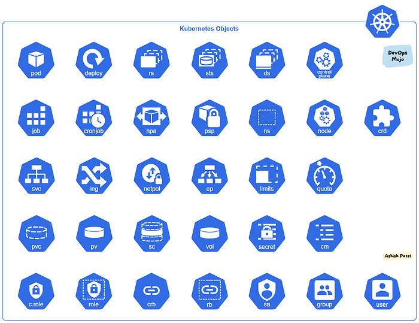
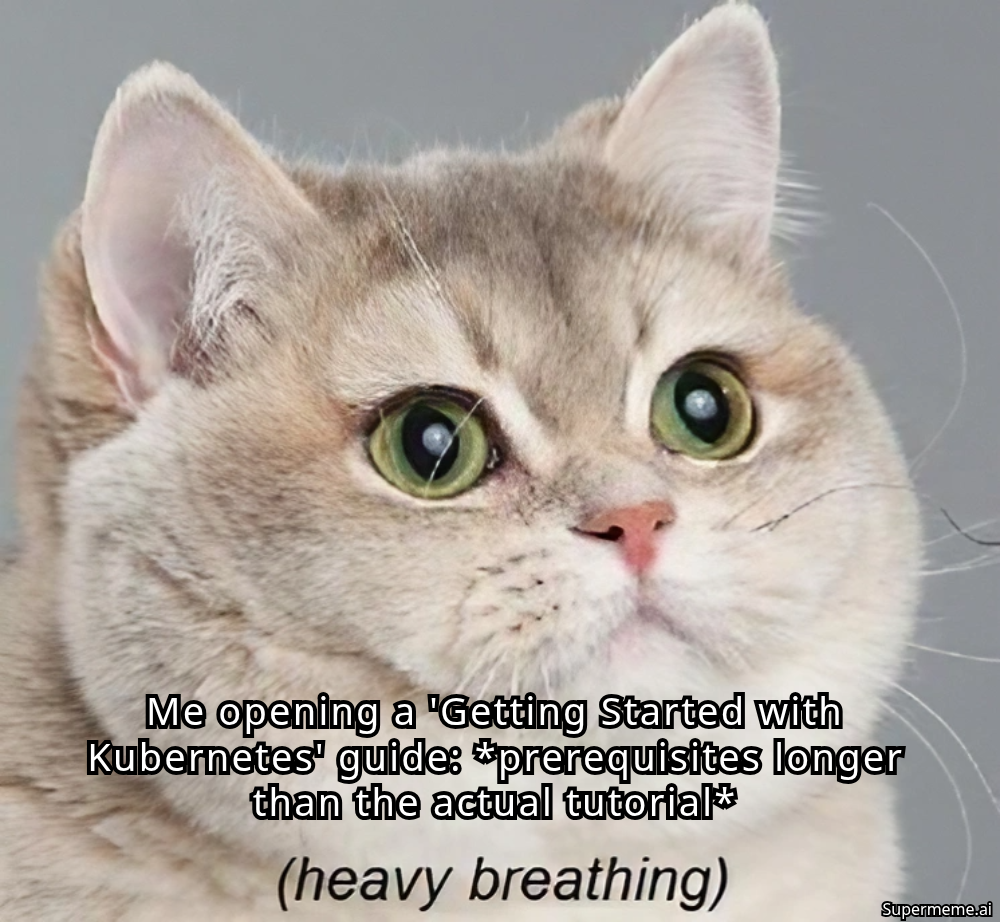
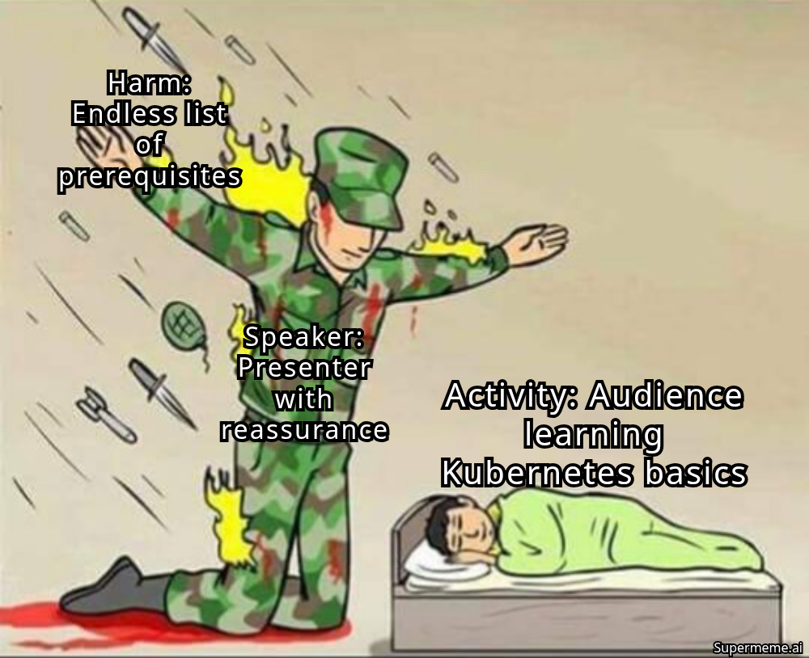
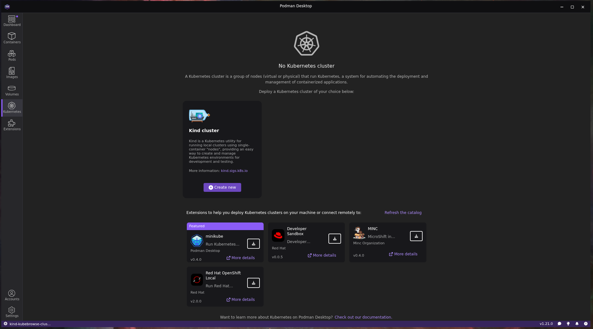

<style>
/* @theme graph_paper */
/* Author: rnd195 https://github.com/rnd195/ */
/* MIT license https://github.com/rnd195/my-marp-themes/blob/live/licenses/LICENSE */

@import "default";
@import url('https://fonts.googleapis.com/css2?family=Work+Sans&display=swap');

:root {
  font-family: "Work Sans Regular", Arial;
  --main-color: #040014;
  --text-color: #121114;
  --bg-color-alt: #dadada;
  --mark-background: #98d6ff;
}

section {
  background-color: #e3e3f1;
  background-size: 20px 20px;
  background-image: linear-gradient(#3f32af18 1px, transparent 1px), linear-gradient(to right, #ccc89536 1px, #d8d8e62d 1px);
}

h1,
h2,
h3,
h4,
h5,
h6 {
  color: var(--text-color);
}

header {
  font-size: 0.7em;
  color: var(--text-color);
  border-bottom: 1px solid #040014;
}

footer {
  font-size: 0.7em;
  color: var(--text-color);
  border-top: 1px solid #040014;
}

code {
  background-color: #ffffff;
  font-size: 0.9em
}

pre {
  background-color: #ffffff;
}

/* https://github.com/yhatt/marp/issues/263 */
section::after {
  font-size: 0.75em;
  content: attr(data-marpit-pagination) " / " attr(data-marpit-pagination-total);
  color: var(--text-color);
}

/* the "center" keyword centers the image - may break, careful */
/* https://github.com/marp-team/marpit/issues/141#issuecomment-473204518 */
img[alt~="center"] {
  display: block;
  margin: 0 auto;
}

blockquote {
  background: #ffffff;
  border-left: 10px solid var(--main-color);
  margin: 0.5em;
  padding: 0.5em;
}

mark {
  background-color: var(--mark-background);
  padding: 0 2px 2px;
}

table {
  display: block;
  margin: 0 auto;
}

th {
  background-color: #8ea2af;
  color: white;
}

/* || SECTION CLASS: tinytext */
/* new class that makes p, ul, and blockquote text smaller */
/* might be useful for the References slide, use <!-- _class: tinytext --> */
section.tinytext>p,
section.tinytext>ul,
section.tinytext>blockquote {
  font-size: 0.65em;
}


</style>

<div class="color-bar" style="height: 6px; width: 100px; background: linear-gradient(90deg, var(--pine) 70%, var(--gold) 30%);"></div>

## Introduction to Kubernetes (k8s)

<div class="presenter">
    <div class="name">Sai Sanjay</div>
    <div class="title">GSoC 2025 , Open Science Labs </div>
    <div class="title">Chapter Lead , Null Vijayawada </div>
    <div class="title">Prev Vice President Null Chapter  </div>
    <div class="title">Cloud Native Enthusiast </div>
    <!-- socials -->
    <div class="social">
        <a href="https://twitter.com/sanjay7178">Twitter</a>
        <a href="https://github.com/sanjay7178">GitHub</a>
        <a href="https://linkedin.com/in/sanjay7178">LinkedIn</a>
    </div>
    <div class="title">Chapter Lead , Null Vijayawada </div>

---
# Agenda
- Whats the difference between Cloud and Cloud Native ?
- Whats the difference between Virtual Machines and Containers ?
- Whats the difference between Docker and Kubernetes ?
- Why do we need Kubernetes ?
- What is a container ?
- What is a Pod ?
- What is a Node ?
- What is a Cluster ?

---
## Agenda (contd..)
- What is a Namespace ?
- What is a Deployment ?
- What is a Service ?
- What is a ConfigMap ?
- What is a Secret ?
- What is a Volume ?
- What is a Persistent Volume (PV) ?
- What is a Persistent Volume Claim (PVC) ?
- What is a StatefulSet ?
- And many more...
---
## These are know as k8s Objects



---
## Are you getting overwhelmed ?



---
## Don't worry , I got you covered



---

## Prerequisites
- Basic understanding of Linux commands
- Basic understanding of Docker
- Basic understanding of YAML
- Basic understanding of Networking
- Basic understanding of Virtualization
- Basic understanding of Cloud Computing

---
## Production k8s Clusters 
- Google Kubernetes Engine (GKE)
- Amazon Elastic Kubernetes Service (EKS)
- Azure Kubernetes Service (AKS)
- DigitalOcean Kubernetes
- K3s (Lightweight k8s for IoT and Edge devices)
- OpenShift (RedHat's k8s distribution)
- Rancher (k8s management platform)
- VMware Tanzu (Enterprise k8s platform)
- IBM Cloud Kubernetes Service
--- 
## Local k8s Clusters
- Minikube 
- MicroK8s
- kind (Kubernetes IN Docker) 
- k3d (k3s in Docker)
- Docker Desktop (comes with k8s support)
- Podman (comes with k8s support)

> Note: Podman is a daemonless container engine for developing, managing, and running OCI Containers on your Linux System. It is a popular alternative to Docker.
--- 
### For now we will be using kind (Kubernetes IN Docker) to set up a local k8s cluster
- kind runs k8s clusters in Docker containers
- kind is primarily designed for testing k8s itself, but may be used for local development and CI
- kind is a great tool for learning and experimenting with k8s
- kind is easy to set up and use
- kind is open source and free to use
- kind is maintained by the k8s community
--- 
### Setup k8s in podman desktop 


## Getting Started 

- Install Docker Desktop (Windows/Mac) or Docker Engine (Linux)
- Install kubectl (Kubernetes command line tool)
```bash
# For Windows
winget install -e --id Kubernetes.kubectl 
winget install -e --id ahmetb.kubectx
winget install -e --id Helm.Helm
# For Mac & Linux
brew install kubectl kubectx helm 
```
- Install kind (Kubernetes IN Docker) : [link](https://kind.sigs.k8s.io/docs/user/quick-start/#installing-from-release-binaries)


---
### Setting up a local Kubernetes Cluster using kind
```yaml
kind: Cluster
apiVersion: kind.x-k8s.io/v1alpha4

nodes:
- role: control-plane
  image: kindest/node:v1.32.2
- role: worker
  image: kindest/node:v1.32.2
- role: worker
  image: kindest/node:v1.32.2
  extraPortMappings:
  - containerPort : 80 
    hostPort : 80
    protocol : TCP 
  - containerPort : 443
#- role: worker
#  image: kindest/node:v1.31.2
networking:
  apiServerAddress: ""   # Bind to all interfaces (including the public IP)
  apiServerPort: 45803           # External port for API server
  
```

---
<!-- _class: title -->

# A very long title of my beamer-esque presentation
<br/>

Author's name
University of XYZ
2022-26-03
(Only normal text is centered now)

---

# A normal slide

# H1 again
## H2
### H3
- bullet
> quote
```
code
```
text

---
# Title page ad hoc fix

- If the title of your presentation is too long and the border intersects with the text underneath, use the following

```html
# Title
<br/>
<!-- empty line here --->
Author's name
University of XYZ
...
```
- make sure to leave an empty line below the `<br/>` tag

---
<!-- _class: tinytext -->
# Tinytext class

- use `<!-- _class: tinytext -->` to make some text tiny
- might be useful for References